<div align="center">


<br/>

**A complete, production-ready AI assistant built for Data Engineers.**  
Runs entirely on your machine. No cloud. No API keys. No cost.

<br/>


</div>

---

## 🗺️ Architecture Overview

```mermaid
graph TD
    A(["🛠️ Data Engineering Copilot"]):::root

    A --> F["⚙️ Features"]:::branch
    A --> T["🧰 Tech Stack"]:::branch
    A --> P["📋 Prerequisites"]:::branch
    A --> GS["🚀 Getting Started"]:::branch

    F --> F1["💬 Chat Assistant\nRAG over your docs"]:::leaf
    F --> F2["🗄️ SQL Agent\nValidation · CDC · MERGE"]:::leaf
    F --> F3["⚡ Databricks Agent\nPySpark · Delta Lake · SCD"]:::leaf
    F --> F4["🔁 ADF Agent\nPipelines · Expressions · Watermark"]:::leaf
    F --> F5["🧩 Dataverse Agent\nEntity mapping · Validation"]:::leaf
    F --> F6["📋 Jira Agent\nIssues · Workstreams · Remediation"]:::leaf
    F --> F7["🗒️ Meeting Notes Agent\nTranscripts · Action Items"]:::leaf
    F --> F8["📊 PPT Story Agent\nExecutive Storytelling"]:::leaf
    F --> F9["📚 Knowledge Base\nUpload · Index · Search"]:::leaf

    T --> T1["Python 3.9+"]:::leaf
    T --> T2["Streamlit"]:::leaf
    T --> T3["Ollama — Local LLM"]:::leaf
    T --> T4["ChromaDB — Vector DB"]:::leaf
    T --> T5["Pandas / OpenPyXL"]:::leaf
    T --> T6["Sentence Transformers"]:::leaf

    P --> P1["Install Ollama\nollama.com"]:::leaf
    P --> P2["Pull: qwen3:8b\nnomic-embed-text\nllama3.1:8b"]:::leaf

    GS --> GS1["git clone repo"]:::leaf
    GS --> GS2["pip install -r requirements.txt"]:::leaf
    GS --> GS3["streamlit run app.py"]:::leaf
    GS --> GS4["Open localhost:8501"]:::leaf

    classDef root fill:#1e1b4b,stroke:#818cf8,color:#e0e7ff,font-size:15px,font-weight:bold
    classDef branch fill:#0f172a,stroke:#38bdf8,color:#7dd3fc,font-size:13px,font-weight:bold
    classDef leaf fill:#0f172a,stroke:#334155,color:#94a3b8,font-size:11px
```



---

## ✨ Features

<table>
<tr>
<td width="50%">

### 🤖 AI Agents

| Agent | What it does |
|---|---|
| 💬 **Chat Assistant** | RAG over your own documents |
| 🗄️ **SQL Agent** | Validation, CDC, MERGE queries |
| ⚡ **Databricks Agent** | PySpark, Delta Lake, SCD |
| 🔁 **ADF Agent** | Pipelines, Watermark, Expressions |
| 🧩 **Dataverse Agent** | Entity mapping & ingestion |

</td>
<td width="50%">

### 🛠️ Productivity Agents

| Agent | What it does |
|---|---|
| 📋 **Jira Agent** | Issue analysis & remediation plans |
| 🗒️ **Meeting Notes** | Summarize transcripts & action items |
| 📊 **PPT Story Agent** | Executive presentation storylines |
| 📚 **Knowledge Base** | Upload, index & semantically search docs |

</td>
</tr>
</table>

---

## 🧰 Technology Stack

<div align="center">

| Layer | Technology | Purpose |
|:---:|:---:|:---:|
| 🖥️ **UI** | Streamlit | Web interface |
| 🧠 **LLM** | Ollama (qwen3:8b) | Local inference |
| 🗃️ **Vector DB** | ChromaDB | Semantic search |
| 📐 **Embeddings** | nomic-embed-text | Document indexing |
| 📊 **Data** | Pandas / OpenPyXL | File processing |
| 🐍 **Runtime** | Python 3.9+ | Core language |

</div>

---

## ⚙️ Prerequisites

<details>
<summary><b>📥 Step 1 — Install Ollama</b></summary>
<br/>

Download and install from **[https://ollama.com](https://ollama.com)**

Supports macOS, Linux, and Windows (WSL).

</details>

<details>
<summary><b>📦 Step 2 — Pull Required Models</b></summary>
<br/>

```bash
# Primary model
ollama pull qwen3:8b

# Embedding model (for RAG)
ollama pull nomic-embed-text

# Fallback model
ollama pull llama3.1:8b
```

</details>

---

## 🚀 Getting Started

```bash
# 1. Clone the repository
git clone https://github.com/your-username/data-engineering-copilot.git
cd data-engineering-copilot

# 2. Install dependencies
pip install -r requirements.txt

# 3. Launch the app
streamlit run app.py
```

> ✅ Open **http://localhost:8501** in your browser — you're ready to go!

---

## 📁 Project Structure

```
data-engineering-copilot/
├── app.py                        # 🚀 Streamlit entrypoint
├── agents/
│   ├── sql_agent.py              # 🗄️ SQL Agent
│   ├── databricks_agent.py       # ⚡ Databricks Agent
│   ├── adf_agent.py              # 🔁 ADF Agent
│   ├── dataverse_agent.py        # 🧩 Dataverse Agent
│   ├── jira_agent.py             # 📋 Jira Agent
│   ├── meeting_notes_agent.py    # 🗒️ Meeting Notes Agent
│   └── ppt_story_agent.py        # 📊 PPT Story Agent
├── knowledge_base/
│   └── chroma_store/             # 📚 ChromaDB vector store
├── requirements.txt
└── README.md
```

---

## 🤝 Contributing

Contributions, issues, and feature requests are welcome!
Open an [issue](https://github.com/your-username/data-engineering-copilot/issues) or submit a PR.

---

<div align="center">

**Built with ❤️ for Data Engineers**

*100% Local · 100% Free · Zero Cloud Dependency*

</div>

---

<p align="center">Built with ❤️ for Data Engineers &nbsp;|&nbsp; 100% Local &nbsp;|&nbsp; Zero Cloud Dependency</p>
