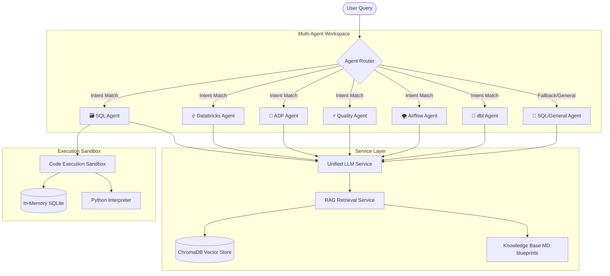

# 🤖 Data Engineering Copilot Hub

[](https://streamlit.io/)
[](https://ollama.com/)
[](https://www.trychroma.com/)
[](https://www.python.org/)

An advanced, multi-agent AI assistant designed to streamline the end-to-end data analytics lifecycle. Powered by **20+ specialized agents** with intelligent intent-based query routing, localized RAG context retrieval, secure code execution sandbox, and a premium glassmorphic Streamlit interface.

---

## 🗺️ System Architecture



---

## 📂 Project Directory Structure

```
data-engineering-copilot/
├── agents/                  # 🤖 Specialized Agent Brains
│   ├── router.py            # Intent-based classifier & routing coordinator
│   ├── sql_agent.py         # SQL validation, CDC, MERGE, & reconciliation
│   ├── databricks_agent.py  # PySpark & Delta Lake SCD operations
│   ├── adf_agent.py         # Azure Data Factory pipeline configuration
│   └── ...                  # 16+ other domain-specific agents
├── config/                  # ⚙️ Application Configuration
│   ├── settings.py          # App globals, thresholds, theme, & metadata
│   ├── logging_config.py    # Standardized logging setup
│   └── providers.py         # Metadata definitions for AI providers
├── knowledge_base/          # 📚 Vector DB Seeds
│   └── preseeded_kb/        # Markdown blueprints (lineage, scd, performance)
├── services/                # 🛠️ Core Service Integrations
│   ├── llm_service.py       # Unified provider API routing (Ollama, OpenAI, Gemini, Claude)
│   ├── rag_service.py       # ChromaDB search, hybrid ranker, & parent retrieval
│   ├── code_execution_engine.py  # Sandbox execution for SQL/Python
│   ├── db_introspector.py   # Schema structure discovery engine
│   ├── git_integration.py   # Git branch checkout & commit simulation
│   └── ...                  # Lineage traversers & profile analyzers
├── ui/                      # 🎨 Streamlit Interface Component Layer
│   ├── dashboard.py         # Main operational metrics & FinOps calculator
│   ├── chat_tab.py          # Multi-agent chat panel (routes query in real-time)
│   ├── sidebar.py           # Provider setup, connection diagnostics, & settings
│   └── ...                  # Interactive tabs per agent
├── utils/                   # 🧰 Chunkers, Parsers, & Helpers
│   ├── chunking.py          # Parent-child document splitter
│   ├── file_parser.py       # Multi-format document parser (PDF, Notebook, JSON)
│   └── helpers.py           # System diagnostics, formatter, & network lookups
├── tests/                   # 🧪 Suite of 87 Unit/Integration Tests
├── app.py                   # 🚀 Application Entry Point
└── requirements.txt         # 📦 Project Dependencies
```

---

## 🤖 Active AI Specialists

The Copilot contains **20+ specialized agents** that cooperate to assist with data engineering tasks:

| Category | Agent | Icon | Capabilities |
| :--- | :--- | :---: | :--- |
| **Orchestration** | **SQL Agent** | 🗃️ | Schema mapping, MERGE templates, reconciliation, & CDC |
| | **Databricks Agent** | 🔥 | PySpark pipeline generation, Delta Lake optimization, SCD Type 1 & 2 |
| | **ADF Agent** | 🔷 | Data Factory metadata pipelines, watermark triggers, JSON configurations |
| | **Airflow Agent** | 🌪️ | DAG topologies, TaskGroups, sensors, & dependency networks |
| | **dbt Agent** | 🧱 | Incremental models, macro setups, Jinja template queries, snapshot configs |
| | **Streaming Agent** | 🌊 | Spark Structured Streaming, Flink DDL, window aggregations, watermarks |
| **Governance** | **Data Quality Agent**| ⚡ | Soda Core check suites, Great Expectations assertions |
| | **Governance Agent**| 🛡️ | Column PII detection, RBAC policies, dynamic masking rules |
| | **Observability Agent**| 👁️ | SLI/SLO threshold alerting rules, Prometheus metrics queries |
| | **Terraform IaC** | 🛠️ | ADLS, S3 buckets, Snowflake resources deployment scripts |
| **Team & Ops** | **Jira Agent** | 🐛 | Task decomposition, technical remediation plans, epic story points |
| | **Meeting Agent** | 📝 | Action items extraction, decision tracking, transcript parsing |
| | **PPT Agent** | 📑 | Executive summaries, slide decks outlines, storyline layout |
| | **Data Catalog Agent**| 📇 | Data dictionaries generation, Source-to-Target lineage diagrams |

---

## ⚡ Quick Start

### 1. Configure the environment
Clone the repository and copy the env configuration file:
```bash
cp .env.example .env
```

### 2. Launch Local LLM Engine (Ollama)
Download and install [Ollama](https://ollama.com/), then pull the default chat and embedding models in your terminal:
```bash
# Start Ollama service
ollama serve

# Pull required models
ollama pull llama3.2
ollama pull nomic-embed-text
```

### 3. Run Setup & Start App
Install python dependencies inside a virtual environment and launch the Streamlit frontend:
```bash
# Setup environment & dependencies
python setup.py

# Launch Streamlit application
streamlit run app.py
```

---

## 🔌 Connection Diagnostics & Troubleshooting

> [!TIP]
> **Using Docker, WSL, or remote VMs?** Here is how to configure local Ollama connectivity:

* **Docker (App inside container, Ollama on host):** Set the **Ollama Base URL** in the sidebar to `http://host.docker.internal:11434`.
* **WSL (App inside WSL, Ollama on Windows host):** 
  1. Expose Ollama on Windows by setting the Windows environment variable `OLLAMA_HOST=0.0.0.0` and restarting Ollama.
  2. Set the **Ollama Base URL** in the sidebar to your Windows host IP (e.g. `http://192.168.1.XX:11434`).
* **IPv6 Loopback Failure:** On some Windows systems, Python resolves `localhost` to the IPv6 address `[::1]`, causing connection failure if Ollama only binds to `127.0.0.1` (IPv4). The application includes an **automatic IPv4 fallback check** that redirects connection attempts to `127.0.0.1:11434` if `localhost` fails.

---

## 💎 Cloud AI Providers
If you want to use cloud-based models instead of local models, select your provider in the sidebar and enter your API keys (or save them directly in your `.env` file):

- **OpenAI:** GPT-4o, GPT-4o-mini (`OPENAI_API_KEY`)
- **Google Gemini:** Gemini 2.0 Flash, Gemini 2.5 Flash (`GOOGLE_API_KEY`)
- **Anthropic:** Claude 3.5 Sonnet, Claude 3 Haiku (`ANTHROPIC_API_KEY`)

*Note: RAG semantic embeddings will continue to process locally on Ollama (via `nomic-embed-text`) to preserve document privacy, unless the local engine is unavailable, in which case it uses local simulation fallback.*
